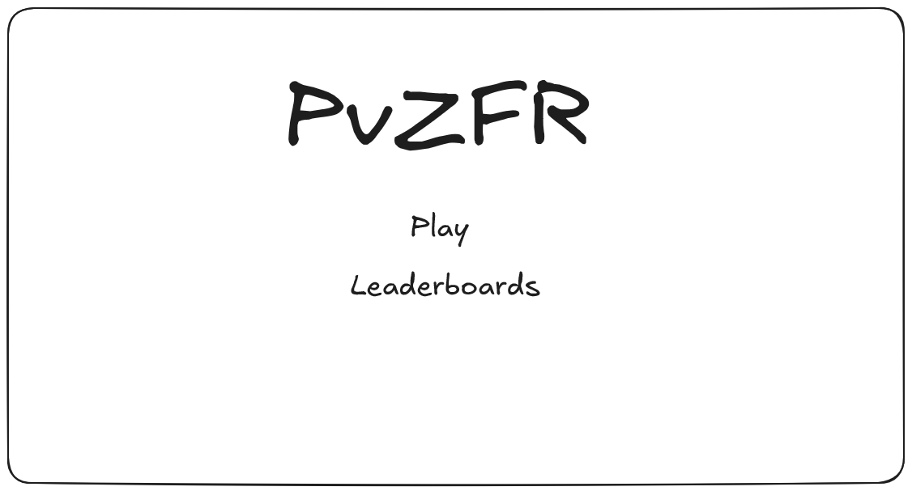
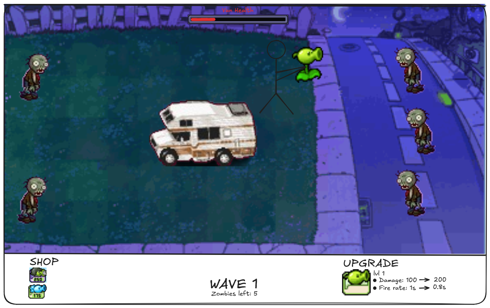

## ✒️ Description

In this endless wave survival game, players get to go back in time and experience one of their favorite childhood video games, Plants vs. Zombies, but with a twist. In Plants vs. Zombies, players are confined to a specific amount of rows in which they can plant pea shooters, wall-nuts, potato mines, etc. In our game, the player will take the role of a character that is able to roam around a gridless yard while also in control of their own portable pea shooter to defeat enemies. Zombies come in waves and the player must defend Crazy Dave's Van from them.

## 🕹️ Gameplay

Players will spawn in at the center of the map along side the van. They will start with the default pea shooter. Zombies will make their way to the van, spawning in waves on either or both sides of the screen. The player is tasked with protecting the van from the zombies by defeating them before they make it to the van and start damaging it. Each wave starts with a grace period of around 20 seconds where no zombies will spawn, spawning regularly afterwards. The wave loop is endless, and can only be broken once the van is destroyed. Defeated enemies will have a chance to drop either coins or diamonds which the player can use in order to purchase upgrades and powerups. Upgrades include having the pea shooter do more damage, fire multiple peas, upgraded firerate. There will also be a shope where the play can buy and plant different kinds of plants on the map. An example of this would be wall-nuts, which would be used to defend the van and stand in the path of zombies. Player movement will use W, A, S, D and the mouse will be used for aiming/shooting, and accessing the shop menu.

## 📃 Requirements

1. The user shall defeat zombies with a weapon.
2. The user shall pick up coins/diamonds dropped from zombies.
3. The user shall purchase weapons/powerups from the shop.
4. The user shall upgrade their current weapon to get better damage and fire rate.

### 🤖 State Diagram

#### Game States

#### Player States

#### Zombie States

### 🗺️ Class Diagram

[](https://mermaid.live/edit#pako:eNqtVe9r2zAQ_VeEPu1HE7avZgzapIzCygLtWij-cpavtlZZCpLcNev6v-8cObHsKCuD-UOI9O7ene49y89cmBJ5xoUC55YSKgtNrhk9X6DBc-2l37BPv2cztlKwQZvG7kxTSDyap_0Uytj7dl2CxzdvE5BFXaJNQqUsF0YpWaYzRQ26wisfMW9P1nf_HLbYtARtSC29BCV_hexLELXUe5KXmCuc9i9cHh5wCQ1UGG0WKEyDF_qxVRotFCoGnQfrB0wqOs61bEaspUy3sx3wvptEP0c6OqAc5vmt-IHCB_1uEdbmCLZoLRUTm4DuVgEjMzVGlyloYeQBYcZu6NdYtjaOlDCJgIRl9tChZfaQ0QujXdvgUZT85KhiEh8Mdyt9HYyWDKzQB3TPt5SWoIg46BUG-n-suJ9rrP_BgbtHas9-GuvrBEsvVcQxi3pYW-nRpcuTkP-SFd5ClvOPOWez2ef-X5gIy1gNbmfDUOC7Q3uhPdp7EHiusEE6RlQx6ZkIKOkd0p0WbuLyQH-Juh2NbuywhDwTgrPWe-o8ohCgVAHi4UjCCjSqOL4wRiFoJt0NmYZuhQHypqoUHiG6xidfmKeY6t5of0Wzj0R3p-UjaIEwIpZuoYzDcthZ083gokNYpDGsus14FppqTteryZ1Cr8FXcqs7aDspZfhCdDN5LShMurfRdojb7U7Bg81-NrvKW5VHnpvP39GiF29ku3C3j6I_zOfd4tQ2xq4kChxnTO_EIW4sWJT__PrNXJACg4f4CadvQQOypE_1Njvnvqbp5DyjvyXYh5znuouD1purjRY887bFE25NW9U8uwflaBX83X_ndyFr0HfGNH3Qyx-hQn3T)

### 🧵 Wireframes

This is the title screen that will greet the player upon loading up the game. It will have a background, but for now there isn't one displayed in the wireframe. There's leaderboards that will display saved scores by different players, the scores are calculated based on amount of waves (rounds) survived.

> [!note]
> The map will be bigger so it will take more time for the zombies to reach the van.

This is a rough display of what the game will sort of look like, zombies will be coming from both sides and the player will start in the middle holding a pea shooter.
The shop at the bottom will be filled with multiple different weapons/powerups, for the wireframe we are only showing 2.
The upgrade part displays the weapon that the player is currently holding (the default pea shooter), this section will allow the player to upgrade their weapon in terms of damage and fire rate (potentially more stats to come). The health bar at the top is the van's health, it will take damage every time a zombie hits it.

### 🏭 Factory Design Patern

The zombies will have different types determined by their speed and armor. When you call the method to generate a zombie instance on the zombieFactory, you will pass in the speed level (walk, run), and armor level (none, cone, bucket). Depending on these parameters, a regular, fast, or armored zombie will be returned. There cannot be armored and fast zombies, only one or the other.

### 🎨 Assets

We used [excalidraw.com](https://excalidraw.com/) to create the wireframes.

We plan on using sprites from the DS / DSi version of the Plants vs. Zombies game, we were able to find them at [spriters-resource.com](https://www.spriters-resource.com/ds_dsi/pvszds/).

#### 🖼️ Images

Images that we plan on using the background of each map are also from the DS / DSi version of the Plants vs. Zombies game, we were able to find them at [spriters-resource.com](https://www.spriters-resource.com/ds_dsi/pvszds/).

#### ✏️ Fonts

For fonts there seems to be some Plants vs. Zombies fonts pulled directly from the game files that we found at [plantsvszombies.fandom.com](https://plantsvszombies.fandom.com/f/p/2519622733529499385#), however we haven't had a chance to test them since we haven't started developing the game, so worst case we will get our fonts from [dafont.com](https://www.dafont.com/).

#### 🔊 Sounds

We plan on using the same audio that's used in the Plants vs. Zombies games, and we were able to find a lot of them from the 2 following websites:

- [sounds-resource.com](https://www.sounds-resource.com/pc_computer/plantsvszombies/sound/1430/)
- [khinsider.com](https://downloads.khinsider.com/game-soundtracks/album/plants-vs.-zombies-2009-gamerip-pc-ios-x360-ps3-ds-android-mobile-psvita-xbox-one-ps4-switch)
  
If we run into any issues where we can't find an audio for something from that website then we'll find audio from [freesound.org](https://freesound.org/people/GameAudio/).